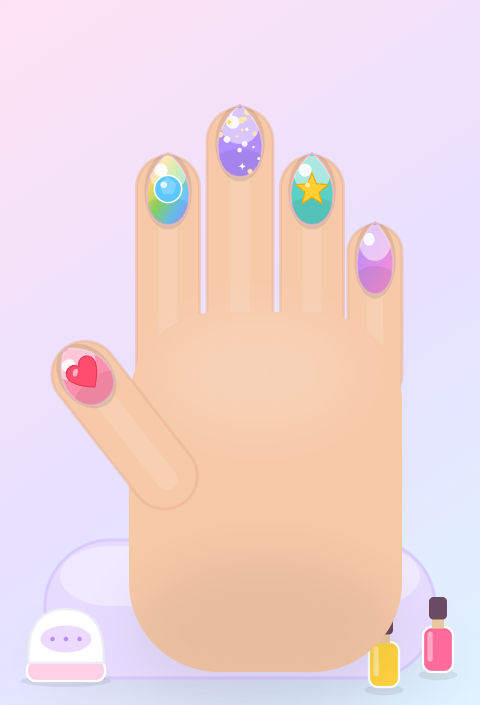

# ✨ Nail Salon ✨

A gentle, ad-free nail salon game made for little kids (about 5 years old).

- **No ads. No paywalls. No sign-ups. No internet needed.** Just play.
- Runs in any web browser — on a computer, phone, or tablet.
- Big, friendly buttons and soft pastel colors designed for small hands.



## What you can do

- 💅 **A little salon scene** — the hand (or foot!) rests on a cushion with
  polish bottles and a tiny nail lamp, just like a real nail salon.
- 🎨 **Paint** — pick a cute polish bottle (solid colors *and* sparkly
  gradient polishes) and tap a nail.
- 💠 **Nail shapes** — choose oval, round, almond, square, or coffin.
- ✨ **Themed sticker packs** — **Cute** (hearts, stars, flowers, bows,
  rainbows, glitter), **Sea** (shells, starfish, fish, pearls),
  **Party** (balloons, cake, gifts, crowns), and **Gems** (a diamond and
  shiny colored rhinestones).
- 🪷 **Henna (mehndi)** — a guided, salon-style design: pick a *look*
  (**Bloom**, **Star**, or **Dotty**) and tap the back of the hand to place an
  ornate mandala, or a finger/toe to add a matching vine sprig — each lands in
  the right spot, sized and angled for you. Tap **✨ Fill it all** to do the
  whole design at once. Reddish-brown like a real stain; each hand and foot
  keeps its own design.
- 🦶 **Hands *and* toes** — tap the top-left button to switch between doing a
  manicure and a pedicure. Each keeps its own design.
- ✋ **Skin tones** — pick a hand that looks like theirs.
- 🧽 **Wipe** one nail clean, or 🧼 **start over**.
- 📸 **Save a picture** of the design to keep.

Every tap gives a little sparkle, a springy pop, and a soft chime. 🎵

## How to play

1. Open `index.html` in a web browser.
2. Use the **tabs** at the bottom — Colors, Stickers, Henna, Shapes, Skin, Wipe.
3. Pick something, then **tap a nail** to use it (or, for henna, tap the back
   of the hand or a finger).
4. Use the top buttons any time: ✋/🦶 hand or foot, 🔊 sound, 📸 save,
   🧼 start over.

## Run it

Just double-click `index.html`, or serve the folder:

```bash
python3 -m http.server 8000
```

Then open http://localhost:8000 in your browser.

## Play it online (GitHub Pages)

This repo publishes itself to **GitHub Pages** — every push to `main` puts the
latest version online automatically, no build step and no server to run.

One-time setup on GitHub:

1. Go to the repo's **Settings → Pages**.
2. Under **Build and deployment → Source**, choose **GitHub Actions**.

That's it. The `deploy pages` workflow (in `.github/workflows/pages.yml`)
uploads the site and publishes it. After it runs, the live link appears at the
top of the workflow run and under **Settings → Pages** — usually
`https://<your-username>.github.io/nail-salon/`. Share that link and anyone can
play.

## Put it on a phone or tablet (including Android)

Because it's a normal, self-contained web page, you can:

- Copy this folder to the device and open `index.html`, **or**
- Host the folder anywhere free (GitHub Pages, Netlify, etc.) and open the link.

Then, in the browser's menu, choose **"Add to Home Screen."** It gets its own
icon and opens full-screen, so it feels just like an app — no app store, no
downloads, no ads.

## Why a web page instead of an app?

It's the simplest thing that works everywhere, needs no installation or
app-store account, and can never sneak in ads or purchases. The whole game is a
few small files with no dependencies and no tracking.

## Project layout

```
nail-salon/
├── index.html        # the page
├── css/styles.css    # looks and layout
├── js/game.js        # the game (scene, hand/foot, shapes, stickers, sounds)
├── fonts/
│   ├── fredoka.woff2 # the rounded title font (self-hosted for offline use)
│   └── OFL.txt       # its license
└── README.md
```

## Credits

- Everything you see — the hand, foot, glossy nails, gems, stickers, bottles,
  and lamp — is drawn with plain SVG and CSS. No image files, no tracking, no
  dependencies.
- Font: **[Fredoka](https://fonts.google.com/specimen/Fredoka)** by Milena
  Brandão & Hafontia, used under the SIL Open Font License 1.1 (see
  `fonts/OFL.txt`). Bundled locally so the game needs no internet.

Made with love for a 5-year-old who just wants to paint nails in peace. 💅
